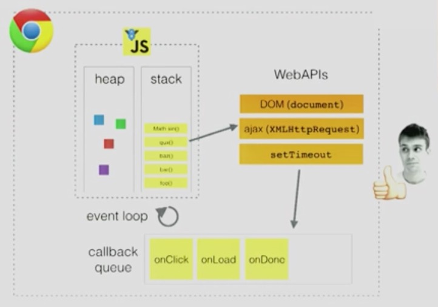
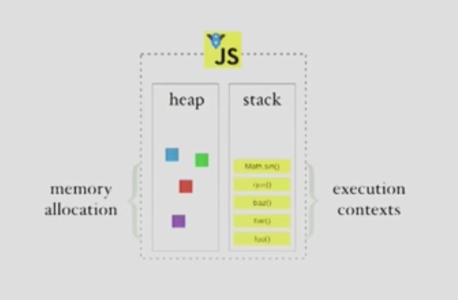
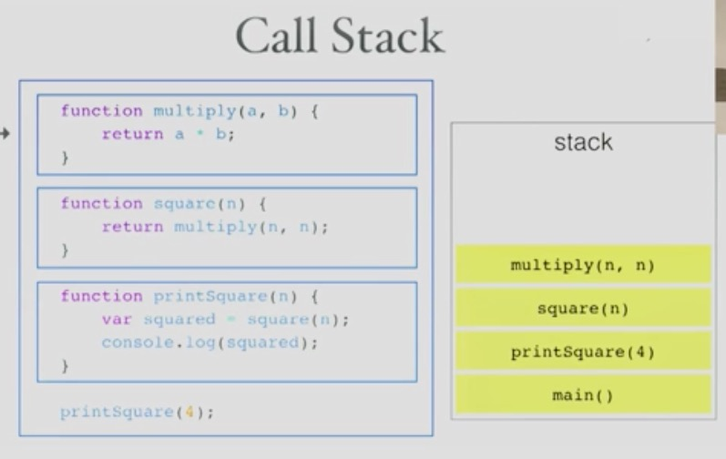
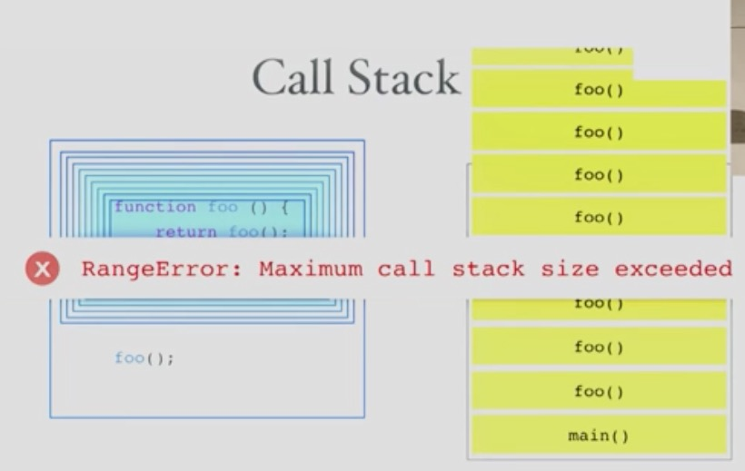

JavaScript 单线程，非阻塞，异步，并发的运行时

拥有一个调用栈（`call stack`），一个事件循环（`event loop`），一个回调队列（`callback queue`），一些其他的 api 等。

V8 引擎包括一个堆 heap 和一个栈 stack。堆用于内存分配，栈用于执行上下文。

## 调用栈

单线程 == 单调用栈 == 一次执行一个事务

如果错误的使用递归，会造成爆栈。

## 阻塞

如果执行很慢，会怎样？

浏览器会同时执行很多动作，如果很慢，会造成交互的阻塞，用户体验很差。

解决方案就是**异步回调（Asynchronous Callback）**。

## 并发和事件循环

一次执行一个事务，但事实并非如此。

JavaScript 生活在单线程的世界，但是它还有很多兄弟线程，用来执行 `setTimeout`, `ajax` 之类的异步调用。在浏览器这个大家庭，JavaScript，网络 API 和事件循环一起合作，共同完成交互。

## 高级技巧

考虑异步，不要阻塞事件循环。

死循环。

## 提问时间

- 哪些事情很慢？渲染，重绘，排版。
- 绘制/渲染如何与事件循环合作？
- 你讨论的这个超酷 demo 叫什么？[loupe][loupe]

## REF

- [Help, I'm stuck in an event-loop][vimeo] by *Philip Roberts*, 2014/05/09

[vimeo]: https://vimeo.com/
[loupe]: http://latentflip.com/loupe
[philip]: http://latentflip.com/