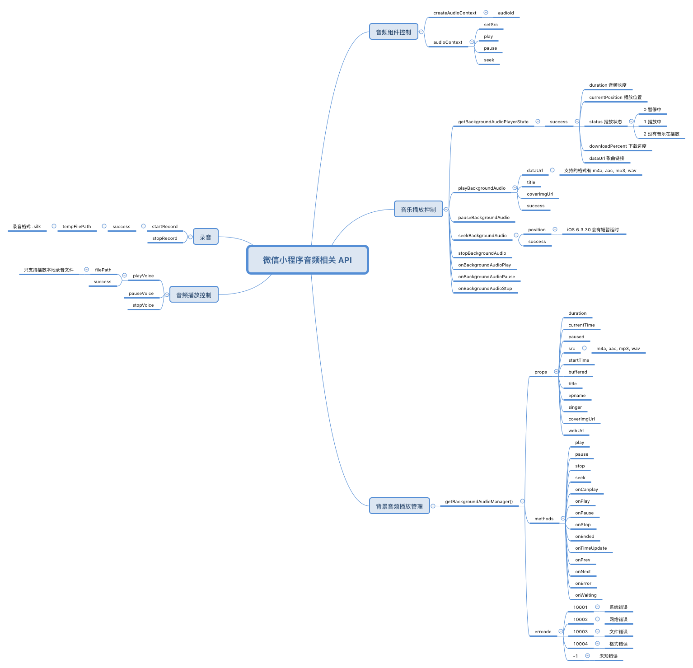

# 微信小程序音频相关 API 小结

* 录音生成的文件格式为 `.silk`
* `wx.playVoice` 只用于播放本地录音文件(`.silk`)格式
* 若要播放服务器端录音文件，需要先 `wx.downloadFile` 下载到本地，再播放
* `wx.playBackgroundAudio` 可播放远程音乐文件，支持格式包括：`.m4a`, `.acc`, `.mp3` 和 `.wav`。
* `wx.playBackgroundAudio` 无法播放本地文件，即使使用 `wx.downloadFile` 下载到本地也不行。
* `wx.getBackgroundAudioManager` 是全局唯一的播放管理器。`wx.playBackgroundAudio` 应该是对它的封装调用。
* `wx.createAudioContext` 可以创建 `audioContext`，作为连接组件和 JSCore 的桥梁。